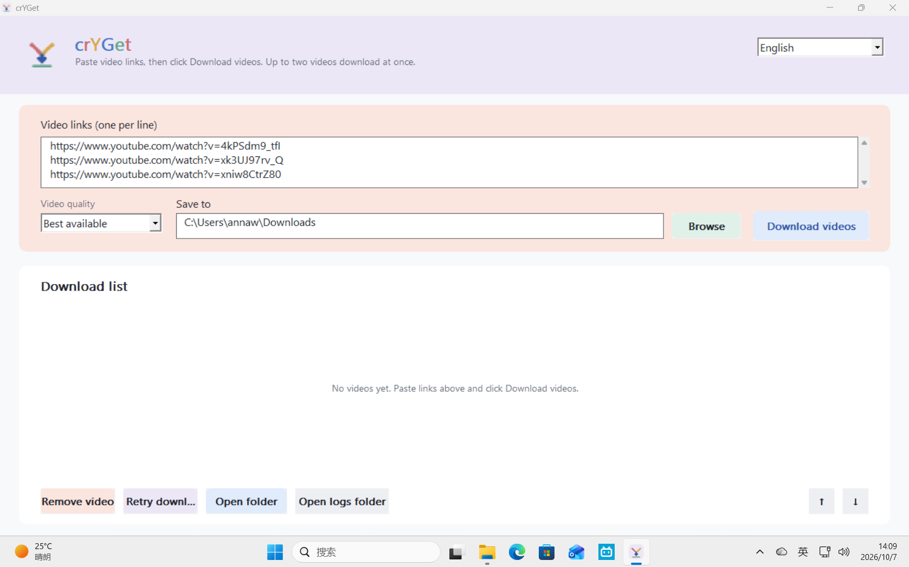
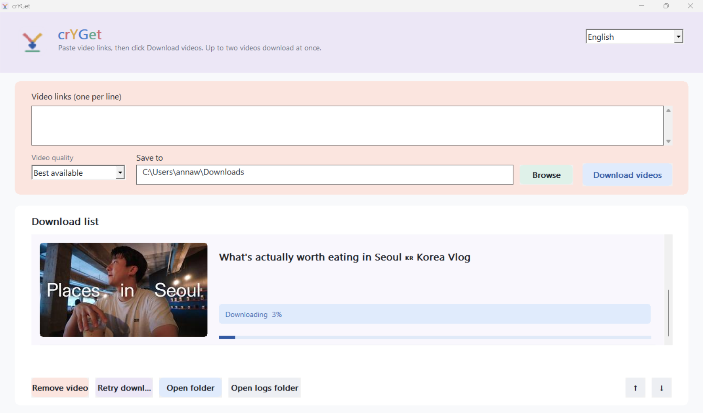
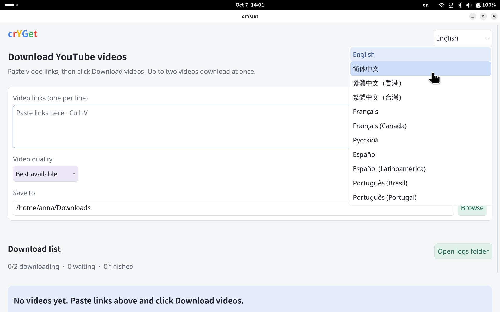
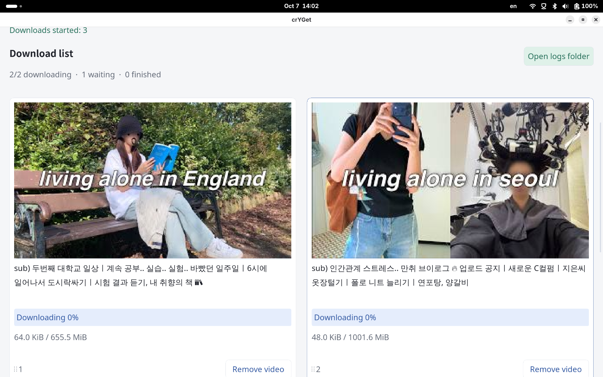

# crYGet

crYGet is a desktop application for downloading YouTube videos. It is written in C++20 and provides a graphical interface for Windows and Linux. The application runs without Python, yt-dlp, or a browser extension.

crYGet is part of the [libcr](https://github.com/libcr) project family.

## Screenshots

### Windows

The link input and quality controls:



A video download in progress:



### Linux

The desktop interface, with the language menu open:



The download list with two active videos and one waiting in the queue:



## Get crYGet

Download the latest packages in this repository:

| System | Package |
| --- | --- |
| Windows 64-bit | [Windows installer](https://github.com/Annawu06/crYGet/releases/download/v2026.10.08/crYGet-Setup-2026.10.08-windows-x64.exe) |
| Debian 13 x86-64 | [Debian package](https://github.com/Annawu06/crYGet/releases/download/v2026.10.08/cryget_2026.10.08%2Bdebian13_amd64.deb) |

The packages use the updated icon. The Linux package includes AppStream metadata and two screenshots for software center previews.

On Windows, run the installer and launch crYGet from the Start menu. On Linux, install the matching `.deb` package and launch crYGet from the application menu. The Linux packages install their required system libraries through the package manager.

Videos with separate MP4 audio and video streams are combined inside crYGet. No FFmpeg executable or library is required. Public YouTube playlist links expand into individual downloads.

## Features

### Downloads

- Add up to 100 YouTube video or public playlist links at a time; playlist entries are expanded into the download queue, and downloads beyond the two active slots are queued.
- Choose the best available quality, 1080p, or 720p, and select a save folder.
- View download progress, speed, and estimated remaining time.
- Reorder queued downloads, retry failed downloads, and open the output folder from a download card.

### Desktop experience

- Use a native Windows or Linux desktop interface.
- Switch between English, Simplified Chinese, Traditional Chinese, French, Russian, Spanish, and Portuguese interface variants.
- Open the diagnostic log directory from the application when investigating an error.

### Playback URL handling

- Read video information and MP4 stream URLs from YouTube responses.
- Use the embedded V8 engine to handle supported player signature and `n` parameter transformations.
- Download media without running Python, yt-dlp, or ejs.

## Use crYGet

1. Paste one or more YouTube video URLs or public playlist URLs into the link field.
2. Choose a quality setting and save folder.
3. Select **Download Video**. Additional videos will wait in the queue.

## Build from source

### Linux

On Debian 13 or newer, install a C++20 compiler, Make, `pkg-config`, and development packages for X11, Xft, Fontconfig, libcurl, libjpeg, `libnode-dev`, and `libuv1-dev`. Then run:

```sh
make
./cryget-desktop
```

### Windows

Build in an MSYS2 UCRT64 shell with CMake, Ninja, GCC, Node.js, and libuv development packages:

```sh
pacman -S --needed mingw-w64-ucrt-x86_64-gcc mingw-w64-ucrt-x86_64-cmake mingw-w64-ucrt-x86_64-ninja mingw-w64-ucrt-x86_64-nodejs mingw-w64-ucrt-x86_64-libuv
cmake -S . -B build -G Ninja -DCMAKE_BUILD_TYPE=Release -DNODE_ROOT="$MINGW_PREFIX"
cmake --build build
ctest --test-dir build --output-on-failure
./build/cryget-desktop.exe
```

The repository also provides `scripts/build-windows.sh` for cross-compilation with MinGW-w64 and NSIS, and `scripts/build-release.sh` for building the release installers.

Run the automated tests on Linux with `make test`.

## Current scope

crYGet supports MP4 streams that YouTube exposes to its player. Some videos may be unavailable, including those that require special authorization, use DRM, or rely on player behavior that crYGet does not yet support. YouTube player changes can also affect downloads.

## Reporting issues

When reporting a problem, include your operating system, the steps to reproduce it, and the error shown by the application. Use **Open Log Directory** to find the diagnostic log. Check the log for local file paths before sharing it.

## Third-party components

crYGet embeds V8 through the Node.js embedding library and bundles [Acorn](https://github.com/acornjs/acorn) for player-script parsing. It combines MP4 streams with its own C++ code; the Node.js command is not launched.
